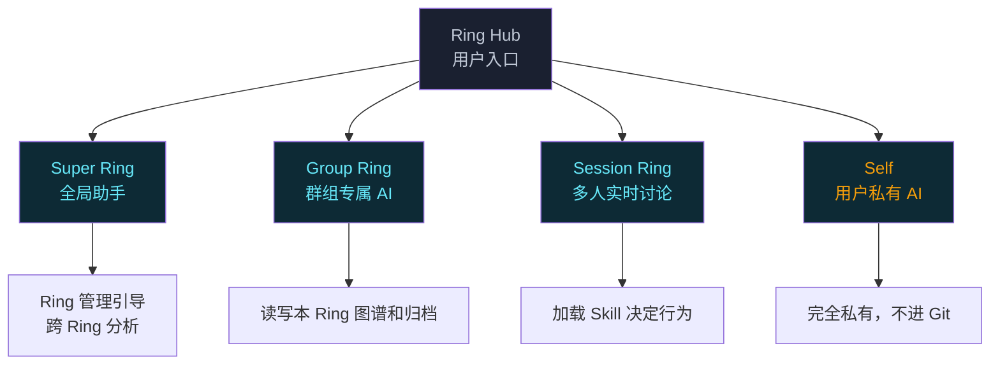

# AGENTS.md — Ring 项目 AI 编码指引

## 项目概述

Ring 是一个面向公司内网的群组知识协作空间。四层 AI 架构（Super Ring / Group Ring / Session Ring / Self），Rust + Axum 后端，React + TypeScript 前端。

## 技术栈

- **后端**：Rust + Axum + SQLite（sqlx）
- **前端**：React + TypeScript + Vite + Zustand
- **LLM**：async-openai（OpenAI + Ollama）+ 自建 Anthropic 适配层

## 代码规范

- 全栈 `snake_case`：Rust 函数/变量、TypeScript 函数/变量、JSON 字段、API 路径
- Rust：`cargo fmt` + `cargo clippy` 必须通过
- TypeScript：ESLint + Prettier
- 不加注释（除非用户要求）
- 错误处理：使用 `crate::error::RingError`，不造新错误类型

## 架构约束

### 四层 AI 架构



### 目录结构

```
~/.ring/                    # 用户数据根目录
├── hub/                    # Super Ring 行为定义
├── rings/                 # Group Ring 数据
│   └── <ring-id>/
│       ├── graph.json      # 群组图谱
│       ├── sessions/       # Session Ring 数据
│       └── .group/        # Group Ring 行为定义
├── self/                   # Self 数据（私有）
└── skills/                 # Skill 插件
```

### 关键约定

- **handlers 不写业务逻辑**：handler 只做参数解析 → 调 service → 返回响应
- **所有业务逻辑在 services 层**
- **前端始终连 localhost:7420**，不直接连创建者后端
- **Session 生命周期**：创建 → 材料准备（必需）→ 讨论 → 总结（可选）→ 结束
- **Skill 系统**：Claude Code Skill 格式（YAML frontmatter + Markdown），5 个预装 Skill
- **平台支持**：Windows / Linux (WSL) / macOS (Apple Silicon + Intel)

## 设计文档

| 内容 | 路径 |
|------|------|
| 四层架构设计 | `docs/superpowers/specs/2026-04-15-ring-redesign-design.md` |
| 实现计划 | `docs/superpowers/plans/` |

## 测试

```bash
cargo test                    # Rust 单元 + 集成测试（71 个测试）
cd ui && npm run lint         # 前端 lint 检查
cd ui && npm test             # 前端测试（vitest）
```

## 命名约定

- 代码中 `Ring` = 群组空间
- 产品整体 = `ring-server`（二进制名）
- 用户数据目录 = `~/.ring/`
- 产品源码仓库 ≠ 用户 Ring（群组）的 GitLab 数据仓库