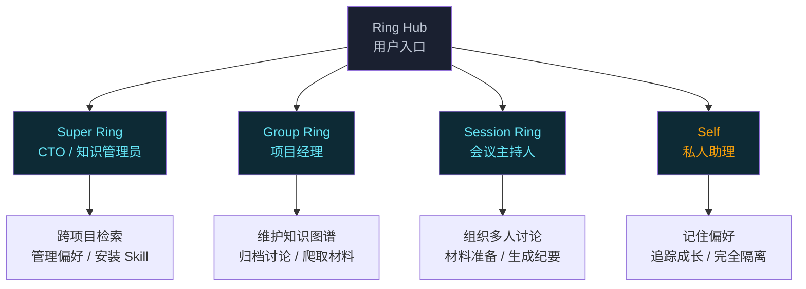

<div align="center">


**AI 驱动的本地知识协作平台**

<p>
<a href="https://www.rust-lang.org"></a>
<a href="https://react.dev"></a>
<a href="LICENSE"></a>
<a href="#"></a>
</p>

</div>

---

## 为什么做 Ring

团队每天都在群里讨论问题、做决策、分享知识。三个月后，这些宝贵的上下文散在聊天记录里，找不到了。新成员加入，同样的知识点要重复讲三遍。老成员离职，带走了一堆只有他知道的隐性知识。

**Ring 解决这个问题的方式：让 AI 参与每一次团队对话，自动把讨论变成结构化的、可搜索的、可追溯的知识。**

不是又一个笔记工具，不是又一个 Wiki。Ring 的核心设计是**"对话即知识生产"**——你正常聊天，AI 在背后做三件事：

1. **实时提取概念** — 聊到"微服务拆分"，AI 推荐在知识图谱里创建一个节点
2. **自动归档** — 讨论结束后，一键把结论写成 Markdown，Git commit
3. **跨 Ring 检索** — 三个月后在另一个项目聊到类似问题，Super Ring 自动提醒"你们在 X 项目讨论过"

所有数据存在你自己的机器上，用 SQLite + Git，不依赖任何云服务。

---

## 核心设计

### 四层 AI 架构

Ring 不只有一个"聊天机器人"。四层 AI 各司其职，像团队里的不同角色：



### 知识图谱 ≠ 思维导图

Ring 的图谱是**活的**——每个节点背后是一段可点击的对话历史：

- 创建节点时，AI 自动建议关联的已有节点
- 点击节点，右侧展开详情面板，显示这个概念的来源对话
- 节点可以折叠/展开，形成层级树（topic → category → leaf）
- 支持多图谱：一个项目可以有"技术架构"和"业务分析"两个独立图谱

### Git 作为时间机器

所有归档都是 Git commit：

```
archives/
├── 2026-04-28-竞品分析.md      ← 第一次讨论
├── 2026-04-29-竞品分析-v2.md   ← 补充新发现
└── 2026-05-01-最终结论.md      ← 结论归档
```

不满意？Revert。想对比两个版本的差异？ArchivePanel 里点 View Diff。

---

## 安装 Ring

### 方式一：下载预编译二进制（推荐）

```bash
# macOS (Apple Silicon)
curl -L https://github.com/kailiangshang/Ring/releases/latest/download/ring-darwin-arm64 -o ring
chmod +x ring
./ring

# macOS (Intel)
curl -L https://github.com/kailiangshang/Ring/releases/latest/download/ring-darwin-x64 -o ring
chmod +x ring
./ring

# Linux
curl -L https://github.com/kailiangshang/Ring/releases/latest/download/ring-linux-x64 -o ring
chmod +x ring
./ring

# Windows (PowerShell)
Invoke-WebRequest -Uri https://github.com/kailiangshang/Ring/releases/latest/download/ring-windows-x64.exe -OutFile ring.exe
.\ring.exe
```

浏览器打开 http://localhost:7420，完成 Setup 向导即可使用。

> 支持自定义端口：`./ring -p 8080`

#### macOS 安装注意事项

首次运行时，macOS 可能会弹出提示："无法验证开发者"。这是因为预编译二进制未经 Apple 公证（Notarization）。

**终端方式（推荐）：**
```bash
xattr -d com.apple.quarantine ./ring
./ring
```

**图形界面方式：**
1. 打开 **系统设置** → **隐私与安全性**
2. 向下滚动到"安全性"部分
3. 找到 `ring` 被拦截的提示，点击 **"仍要打开"**
4. 再次运行 `./ring`，在弹出对话框中点击 **"打开"**

### 方式二：从源码构建

需要 Rust 1.85+ 和 Node.js 20+。

```bash
git clone https://github.com/kailiangshang/Ring.git
cd Ring

# 构建前端
cd ui && npm install && npm run build && cd ..

# 构建后端（Release 模式，~17MB 二进制，产物为 target/release/ring）
cd server && cargo build --release && cd ..

# 启动（默认端口 7420）
./server/target/release/ring

# 或使用自定义端口
./server/target/release/ring -p 8080
```

> 注：Rust crate 内部名保留为 `ring-server`（避免与 `ring` crypto 库冲突），但构建产物为 `ring`，与产品名一致。

### 方式三：npm 全局安装（即将支持）

```bash
npm install -g ring
ring
```

---

## 快速开始

### 1. 首次启动

```bash
./ring
# 输出：Ring server listening on http://localhost:7420
```

浏览器访问 `http://localhost:7420`，进入 Setup 向导：

1. **设置昵称** — 你的显示名称
2. **配置 LLM** — 填入 OpenAI API Key 或 Ollama 本地地址，点 TEST 验证连接
3. **GitLab（可选）** — 公司内网有 GitLab 可以填，没有就点 Skip
4. **完成** — 看到命令速查表，点 Enter Ring 进入主界面

### 2. 创建第一个 Ring

左侧边栏点 **+ New Ring**，输入"产品需求分析"，按 Enter。这就是一个**群组知识空间**。

### 3. 开始聊天

右侧聊天区输入：

```
我们要做一个竞品分析，帮我整理一下思路
```

Group Ring AI 会回复，同时：
- 如果你上传了 PDF 竞品报告，AI 自动解析并推荐创建"竞品A""竞品B"节点
- 聊天过程中输入 `/graph`，右侧打开图谱面板
- 输入 `/save`，AI 自动把当前讨论归档为 Markdown + Git commit

### 4. 发起 Session 讨论

```
/session
```

填写标题"Q3 技术选型讨论"，选择 Skill "Decision Making"，点 CREATE。Session Ring 进入材料准备阶段，你可以上传参考资料。准备完成后点 Start Discussion，邀请团队成员加入，实时 WebSocket 聊天，最后点 Summarize 生成会议纪要。

### 5. 常用命令

| 命令 | 效果 |
|------|------|
| `/save [标题]` | 触发归档，可选自定义标题 |
| `/graph` | 打开/关闭图谱面板 |
| `/session` | 打开 Session 面板 |
| `/archive` | 打开归档面板 |
| `/help` | 查看所有可用命令 |
| `@self 帮我记一下...` | 在 Group Ring 中召唤 Self AI |
| `@super 跨 Ring 搜索...` | 切换到 Super Ring 上下文 |

---

## 项目结构

```
Ring/
├── server/                 Rust 后端
│   ├── src/
│   │   ├── routes/         HTTP API 端点（~30 个模块）
│   │   ├── services/       业务逻辑（chat/archive/graph/session/...）
│   │   ├── models/         数据模型 + SQL 查询
│   │   └── prompts.rs      所有 AI 提示词集中管理
│   ├── migrations/         18 个 SQLite 迁移文件
│   └── Cargo.toml
├── ui/                     React 19 + TypeScript 前端
│   ├── src/
│   │   ├── components/     UI 组件（面板/聊天/图谱/...）
│   │   ├── stores/         Zustand 5 状态管理
│   │   └── services/       API 调用封装
│   └── package.json
└── docs/                   文档
    ├── STATUS.md           功能状态 + 路线图
    ├── ARCHITECTURE.md     架构全流程 + 数据模型
    ├── BACKEND_TEST.md     后端 API 测试清单（26 个模块）
    └── product/
        ├── PRD.md          产品需求文档
        └── UI-DESIGN.md    前端设计规范
```

---

## 数据目录

Ring 所有数据存放在 `~/.ring/`，完全本地，你可以直接 `cp -r ~/.ring ~/backup` 备份：

```
~/.ring/
├── hub/                    Super Ring 全局配置
│   ├── system_prompt.md    AI 行为定义
│   └── user_preferences.md 用户偏好
├── rings/
│   └── <ring-id>/          每个 Ring 独立目录
│       ├── graph.json      知识图谱（JSON 格式）
│       ├── sessions/       Session 讨论记录
│       ├── archives/       归档文件（Git 仓库！）
│       │   └── .git/       自动 init，每次归档一个 commit
│       └── .group/         Group Ring 知识文档
│           ├── role.md           AI 角色定义
│           ├── conventions.md    团队约定
│           ├── active-context.md 当前上下文
│           ├── archive-patterns.md 归档模式
│           ├── corrections.md    纠正记录
│           └── knowledge-summary.md 知识摘要
├── self/                   Self 私有数据（不共享）
│   ├── memory/
│   │   ├── user_profile.md   用户画像
│   │   ├── preferences.md    个人偏好
│   │   ├── active_goals.md   当前目标
│   │   └── growth.md         成长轨迹
│   └── metrics/            使用统计（dwell_time/tool_usage）
├── skills/                 Skill 插件（YAML + Markdown）
└── ring.db                 SQLite 数据库
```

---

## 技术栈

| 层 | 技术 | 选型理由 |
|----|------|---------|
| 后端 | Rust + Axum 0.8 | 零成本抽象，单线程性能 = 10x Node.js，编译后无运行时 |
| 数据库 | SQLite + sqlx | 零配置、单文件、ACID、FTS5 全文搜索 |
| 前端 | React 19 + TypeScript + Vite 8 | 现代并发特性、类型安全、极速 HMR |
| 状态 | Zustand 5 | 无样板代码，跨组件订阅不 re-render |
| 可视化 | D3.js v7 | 力导向图 + 树形图，完全可控的 SVG |
| LLM | async-openai | 一套代码兼容 OpenAI / Anthropic / Ollama |
| 实时 | WebSocket + SSE | WebSocket 用于 Session 多人聊天，SSE 用于 AI 流式输出 |
| 分发 | include_dir! | 前端静态资源嵌入 Rust 二进制，单文件分发 |

**为什么选择 Rust + 单二进制？**

同类产品（Notion/飞书知识库）是 SaaS，数据在云端。Ring 的定位是**本地优先**，所以必须让用户一键运行。Python 需要虚拟环境 + 依赖管理，Node.js 需要 npm install，Go 需要运行时——Rust 编译后是原生机器码，17MB 一个文件，双击即运行。这才是"安装 Ring"该有的体验。

---

## 测试

```bash
# 后端测试（71 个集成测试）
cd server && cargo test
# test result: ok. 71 passed; 0 failed

# 前端构建验证
cd ui && npm run build

# 完整手动测试清单
cat docs/BACKEND_TEST.md
```

---

## 版本历史

| 版本 | 日期 | 说明 |
|------|------|------|
| v0.1.0 | 2026-04-30 | 首个发布版本 — 安全加固完成，71 测试通过，支持 CLI 参数 |

### v0.1.0 完整功能清单

**四层 AI**
- Group Ring 聊天 + tool_calls（file_parse / knowledge_extract / fetch_url）
- Super Ring 跨 Ring 检索 + 偏好管理 + Skill 安装 + create_ring tool
- Session Ring 全生命周期（材料准备 → 讨论 → 总结 → 归档）
- Self 私有 AI + 自动记忆提取 + 成长追踪

**知识图谱**
- D3.js 力导向图 + 节点树列表视图（Canvas/Tree 双模式）
- 多图谱支持（每 Ring 3 个）
- 节点类型 + 标签 + 展开折叠
- 蓝图构建器（AI 引导多轮对话设计图谱）

**归档系统**
- AI 驱动归档 + Git commit
- PR Review（merge / reject / diff）
- Git revert + Git History 查看

**协作**
- Open / Audit 邀请系统
- 成员管理 + 角色变更 + Session 权限
- HTTP bundle 同步（creator-wins）
- 通知系统（归档/成员/Session 事件）

**导出**
- Markdown / PDF / JSON / tar.gz / SVG / PNG

详见 [CHANGELOG.md](CHANGELOG.md)

---

## 未来路线图

### v1.1 — 体验优化（2026 Q2）
- 移动端响应式适配
- Linux / Windows / macOS ARM 多平台预编译二进制
- npm 全局安装
- 自动更新检查

### v1.2 — AI 增强（2026 Q3）
- Headless Chrome 网页爬取（JavaScript 渲染页面）
- 本地 Embedding + 向量语义搜索
- 多步骤 Agent 工作流（研究 → 总结 → 归档 → 图谱更新）
- 语音输入（Web Speech API）

### v1.3 — 企业级（2026 Q4）
- SSO 集成（OAuth2 / LDAP）
- 审计日志
- 数据库加密 at-rest
- 集群部署（LiteFS / rqlite）

详见 [docs/STATUS.md](docs/STATUS.md)

---

## 文档

| 文档 | 内容 | 面向谁 |
|------|------|--------|
| [STATUS.md](docs/STATUS.md) | 功能状态 + 路线图 + 技术债 | 开发者 |
| [ARCHITECTURE.md](docs/ARCHITECTURE.md) | 数据模型、请求流程、多人协作架构 | 开发者 |
| [BACKEND_TEST.md](docs/BACKEND_TEST.md) | 26 个模块 API 测试清单 | QA / 测试 |
| [PRD.md](docs/product/PRD.md) | 产品需求文档 | 产品经理 |
| [UI-DESIGN.md](docs/product/UI-DESIGN.md) | 设计规范（颜色/字体/布局） | 设计师 |
| [AGENTS.md](AGENTS.md) | AI 编码指引 | AI 助手 |

---

## License

MIT License — 详见 [LICENSE](LICENSE)

---

<div align="center">

**把团队的每一次对话，变成可复用的知识**

</div>
