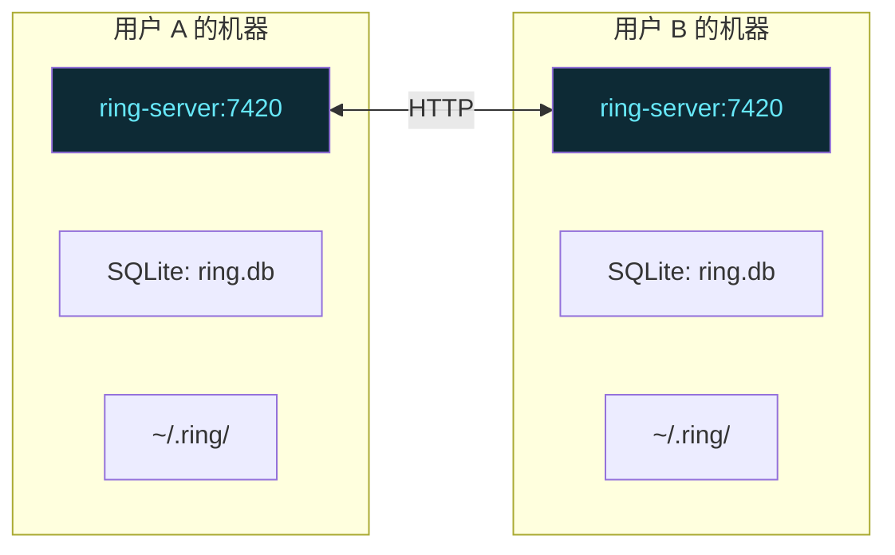
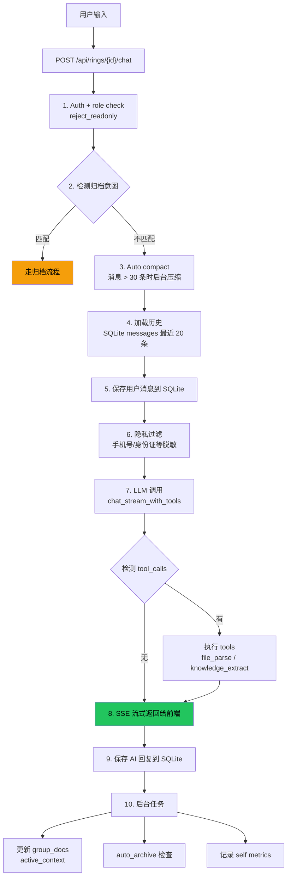
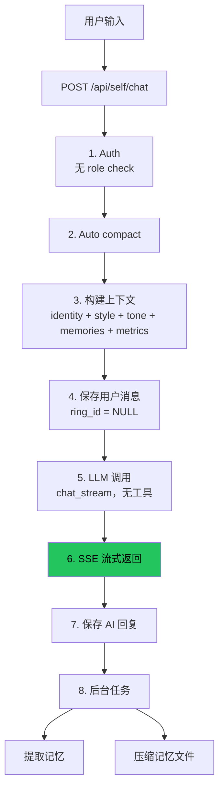
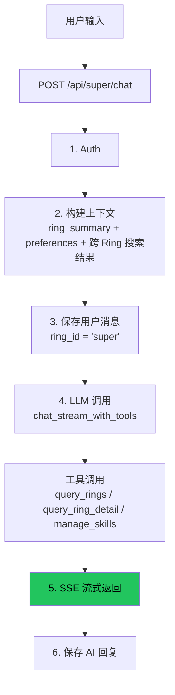
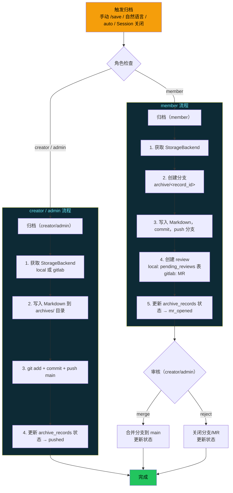
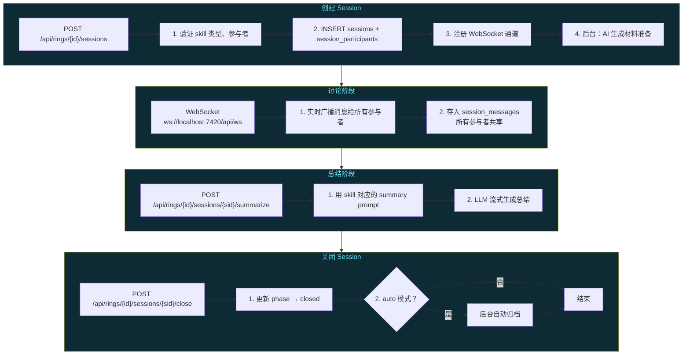
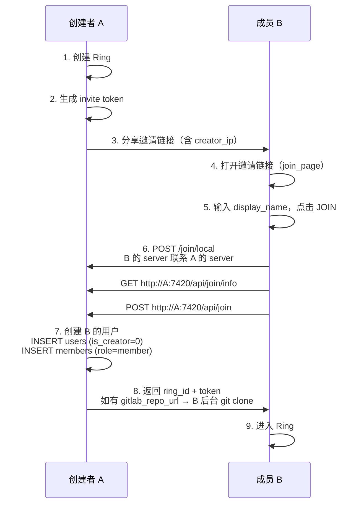

# Ring 架构全流程文档

> 生成时间：2026-04-26
> 目的：全量梳理 Ring 的数据模型、请求流程、多人协作现状，作为后续决策基础。

---

## 1. 核心架构

Ring 是一个**单用户部署**的知识协作工具。每个用户在自己的机器上跑一个 `ring-server`，数据存在本地 SQLite + 文件系统。

多人协作是后来加的——通过 HTTP 互连。



每个 ring-server 有自己独立的 SQLite 数据库和文件系统。**没有中心化服务器**。

---

## 2. 数据存储

### 2.1 SQLite（`~/.ring/ring.db`）

| 表 | 用途 | 是否有 user_id |
|---|---|---|
| `users` | 用户账户、LLM 配置、GitLab 凭证 | token_id 为主键 |
| `rings` | 群组空间元数据 | creator_id |
| `members` | 环成员关系和角色 | (ring_id, user_id) 联合主键 |
| `messages` | 聊天消息 | user_id，按 (ring_id, user_id) 过滤 |
| `graphs` | 图谱（每 Ring 最多 3 个） | 无 user_id，按 ring_id |
| `graph_nodes` | 图谱节点 | 无 user_id，按 ring_id |
| `graph_edges` | 图谱边 | 无 user_id，按 ring_id |
| `sessions` | 会议实例 | 无 user_id，按 ring_id |
| `session_messages` | 会议消息（WebSocket） | 无 user_id，按 session_id |
| `session_participants` | 会议参与者 | token_id |
| `session_materials` | 会议材料 | 无 user_id |
| `group_docs` | 群组文档（auto-maintained） | 无 user_id，按 ring_id |
| `archive_records` | 归档记录 | archived_by |
| `pending_reviews` | 本地模式审核队列 | 无 user_id，按 ring_id |
| `invite_tokens` | 邀请令牌 | created_by |
| `join_requests` | 入群申请 | 无 user_id |
| `notifications` | 通知 | user_id |
| `search_index` | FTS5 全文索引 | 无 user_id，按 ring_id |
| `conversation_tokens` | Token 用量统计 | user_id |

### 2.2 文件系统（`~/.ring/`）

```
~/.ring/
├── ring.db                    # SQLite
├── hub/
│   ├── token                  # 创建者 token（用于恢复）
│   └── system_prompt.md       # Super Ring 自定义提示词
├── rings/                     # 每 Ring 一个目录（git 仓库）
│   └── <ring-id>/
│       ├── .git/              # git 仓库
│       ├── archives/          # 归档 Markdown 文件
│       ├── graphs/            # 图谱导出
│       ├── .group/            # 群组行为文档（6 份）
│       ├── assets/            # 上传资源（gitignored）
│       └── .ring-local/       # 本地数据（gitignored）
├── skills/                    # Skill 插件
│   └── <skill-name>/          # YAML + Markdown
└── self/                      # 用户私有数据
    └── <token-id>/
        ├── identity           # 身份描述
        ├── style              # 对话风格
        ├── personality        # JSON: tone 等
        ├── metrics.json       # 使用指标
        ├── memories/          # 提取的记忆文件
        └── tool_usage.json    # 工具使用统计
```

### 2.3 Git 仓库

每个 Ring 目录是一个 git 仓库。存储模式决定了怎么用 git：

| 存储模式 | git remote | 审核方式 | commit 权限 |
|---------|-----------|---------|------------|
| `local` | 无 | `pending_reviews` 表 | creator 直推，member 创建分支 |
| `gitlab` | GitLab URL | GitLab MR | creator 直推，member 创建分支+MR |

---

## 3. 角色与权限

| 角色 | 来源 | 聊天 | 图谱读 | 图谱写 | 归档 | 审核 | 成员管理 | Session |
|------|------|------|--------|--------|------|------|----------|---------|
| `creator` | 创建 Ring 自动获得 | ✅ | ✅ | ✅（含删除） | ✅ 直推 | ✅ | ✅ | ✅ |
| `admin` | 被提权 | ✅ | ✅ | ✅（含删除） | ✅ 直推 | ✅ | ✅ | ✅ |
| `member` | 邀请加入（默认角色） | ✅ | ✅ | ✅（无删除） | ✅ 创建分支/MR | ❌ | ❌ | 需 grant |
| `readonly` | 邀请时指定 | ❌ | ✅ | ❌ | ❌ | ❌ | ❌ | ❌ |

权限检查函数：
- `reject_readonly()` — 拒绝 readonly 角色的写操作（~30 个端点）
- `check_admin()` — 要求 creator 或 admin
- `session_grant` — member 需要额外授权才能创建 Session

---

## 4. 关键请求流程

### 4.1 Group Ring 聊天



### 4.2 Self Chat



### 4.3 Super Ring 聊天



### 4.4 归档流程



### 4.5 Session 流程



---

## 5. 多人协作现状

### 5.1 加入流程



### 5.2 加入后的数据分布

**创建者 A 的数据：**

| 数据 | 位置 | B 能看到？ |
|------|------|-----------|
| 聊天消息 | A 的 SQLite | ❌ 按 user_id 隔离 |
| 图谱节点/边 | A 的 SQLite | ❌ 在 A 的本地 DB |
| 归档文件 | A 的 git 仓库 | ❌ 在 A 的本地文件系统 |
| .group/ 文档 | A 的 git 仓库 | ❌ |
| group_docs | A 的 SQLite | ❌ |

**成员 B 加入后的数据：**

| 数据 | 位置 | 来源 |
|------|------|------|
| B 的聊天消息 | B 的 SQLite | B 自己的 LLM 生成 |
| B 的图谱操作 | B 的 SQLite | B 在自己的 DB 里操作 |
| 归档文件 | B 的 git 仓库 | 仅 gitlab 模式会 git clone |
| Self 数据 | B 的 ~/.ring/self/ | B 自己 |

### 5.3 关键发现

**A 和 B 各自独立运行，数据库不共享。**

1. **聊天隔离**：A 和 B 在同一个 Ring 里聊天，但各聊各的。A 看不到 B 的消息，B 看不到 A 的。消息按 `(ring_id, user_id)` 过滤。

2. **图谱分裂**：B 在 Ring 里创建了一个节点，这个节点只存在于 B 的 SQLite 里。A 不知道。如果 A 也创建了同名节点，会有两份。

3. **归档分裂**：
   - GitLab 模式：A 和 B 共享同一个远程 git 仓库，归档文件通过 git push/pull 同步。但节点引用的 `node_id` 可能不一致。
   - Local 模式：A 和 B 各自本地 git 仓库，完全没有同步。

4. **唯一共享的是 Session**：Session 通过 WebSocket 实时广播，所有参与者看到相同的消息。但 Session 消息存在各自的 SQLite 里。

---

## 6. 同步 API 现状

### 已有 API（但未被使用）

| API | 功能 | 问题 |
|-----|------|------|
| `GET /rings/{id}/sync/snapshot` | 返回 git 仓库 tar 包 | 只同步 git 仓库内容（归档文件），不同步图谱数据 |
| `GET /rings/{id}/sync/delta?since={sha}` | 返回 git diff + 文件内容 | 同上，只覆盖 git 仓库 |
| `local_join` | 成员通过 creator_ip 加入 | 只在 gitlab 模式下 git clone，local 模式下什么都不拉取 |

### 缺失的同步

| 数据 | 需要同步？ | 现状 |
|------|-----------|------|
| 图谱节点/边 | ✅ 创建者是 source of truth | 无同步 API |
| 归档文件（local 模式） | ✅ | 无同步（snapshot API 存在但未被调用） |
| .group/ 文档 | ✅ | 无同步 |
| group_docs | ✅ | 无同步 |
| 聊天消息 | ❓ 取决于设计 | 各自独立 |
| Session 消息 | ✅ 已通过 WebSocket 共享 | 实时共享，不需要额外同步 |
| 搜索索引 | ❌ 可从其他数据重建 | 不需要同步 |

---

## 7. CORS 与网络

当前 CORS 只允许 localhost：

```rust
let cors = CorsLayer::new()
    .allow_origin([
        "http://localhost:5173",
        "http://localhost:7420",
        "http://127.0.0.1:5173",
        "http://127.0.0.1:7420",
    ])
    .allow_methods([GET, POST, PUT, DELETE, OPTIONS])
    .allow_headers([Authorization, Content-Type, Accept, X-Ring-Token]);
```

**局域网 IP 不在白名单里。** 这意味着：
- A 的前端（localhost:7420）可以调 A 的后端 ✅
- B 的前端（localhost:7420）可以调 B 的后端 ✅
- B 的后端可以 HTTP 请求 A 的后端（后端之间无 CORS 限制）✅
- B 的前端**不能直接**调 A 的后端 ❌（会被 CORS 拦截）
- B 的 `local_join` 通过后端代理绕过 CORS ✅

---

## 8. 总结：需要解决的架构问题

### 问题 1：数据不共享

A 和 B 各有独立 SQLite，图谱和归档完全分裂。

### 问题 2：同步 API 不完整

- snapshot/delta 只同步 git 仓库，不同步图谱数据（在 SQLite 里）
- local_join 不调用任何同步 API
- 没有从创建者拉取初始数据的流程

### 问题 3：写冲突未定义

如果 B 本地创建了一个图谱节点，这个节点没有 A 那边的 ID。同步时怎么处理？
- 覆盖？B 的修改丢失
- 合并？需要冲突解决
- 代理？B 的写操作转发到 A

### 问题 4：创建者不一定在线

Local 模式下，A 的机器不一定始终在线。B 怎么同步？

### 问题 5：CORS 限制

当前只允许 localhost，局域网访问被拦。

---

## 附录：完整 API 列表

| 方法 | 路径 | 角色 | 数据写入 |
|------|------|------|----------|
| GET | /api/health | any | - |
| GET | /api/prompts | any | - |
| GET | /api/ws | any | - |
| GET | /api/setup/status | any | - |
| GET | /api/setup/recover | any | - |
| POST | /api/setup | 未设置 | users, setup_state |
| PUT | /api/setup | creator | users |
| GET | /api/rings | any | - |
| POST | /api/rings | any | rings, members |
| GET | /api/rings/{id} | member+ | - |
| GET | /api/rings/{id}/members | member+ | - |
| POST | /api/rings/{id}/members | admin+ | members |
| PUT | /api/rings/{id}/members/{tid}/role | admin+ | members |
| POST | /api/rings/{id}/members/{tid}/grant-session | admin+ | members |
| POST | /api/rings/{id}/members/{tid}/revoke-session | admin+ | members |
| DELETE | /api/rings/{id}/members/{tid} | admin+ | members |
| GET | /api/config/llm | any | - |
| PUT | /api/config/llm | any | users |
| POST | /api/config/llm/test | **AuthUser** | - |
| POST | /api/config/gitlab/test | **AuthUser** | - |
| GET | /api/config/privacy_filters | any | - |
| PUT | /api/config/privacy_filters | any | users |
| GET | /api/rings/{id}/mode | member+ | - |
| PUT | /api/rings/{id}/mode | member+ | rings |
| GET | /api/rings/{id}/group-docs/{name} | member+ | - |
| PUT | /api/rings/{id}/group-docs/{name} | member+ | group_docs |
| POST | /api/rings/{id}/chat | member+ | messages, search_index, group_docs, maybe archive |
| GET | /api/rings/{id}/chat/history | member+ | - |
| POST | /api/self/chat | any | messages |
| GET | /api/self/chat/history | any | - |
| GET | /api/self/identity | any | - |
| PUT | /api/self/identity | any | filesystem |
| GET | /api/self/style | any | - |
| PUT | /api/self/style | any | filesystem |
| GET | /api/self/metrics | any | - |
| POST | /api/self/metrics/heartbeat | any | filesystem |
| GET | /api/self/personality | any | - |
| PUT | /api/self/personality | any | filesystem |
| GET | /api/self/privacy | any | - |
| PUT | /api/self/privacy | any | filesystem |
| GET | /api/self/export | any | - |
| POST | /api/self/reset | any | SQLite + filesystem |
| GET | /api/self/memory | any | - |
| GET | /api/self/memory/{name} | any | - |
| PUT | /api/self/memory/{name} | any | filesystem |
| DELETE | /api/self/memory/{name} | any | filesystem |
| GET | /api/rings/{id}/graph | member+ | - |
| POST | /api/rings/{id}/graph | member+ | graph_nodes, search_index |
| GET | /api/rings/{id}/graphs | member+ | - |
| POST | /api/rings/{id}/graphs | member+ | graphs |
| DELETE | /api/rings/{id}/graphs/{gid} | admin+ | graphs, nodes, edges |
| PUT | /api/rings/{id}/graph/nodes/{nid} | member+ | graph_nodes |
| DELETE | /api/rings/{id}/graph/nodes/{nid} | admin+ | graph_nodes |
| POST | /api/rings/{id}/graph/edges | member+ | graph_edges |
| DELETE | /api/rings/{id}/graph/edges/{eid} | member+ | graph_edges |
| GET | /api/rings/{id}/sessions | member+ | - |
| POST | /api/rings/{id}/sessions | member+ (grant) | sessions, participants |
| GET | /api/rings/{id}/sessions/{sid} | member+ | - |
| DELETE | /api/rings/{id}/sessions/{sid} | owner | sessions |
| POST | /api/rings/{id}/sessions/{sid}/close | owner | sessions, maybe archive |
| POST | /api/rings/{id}/sessions/{sid}/reopen | owner | sessions |
| POST | /api/rings/{id}/sessions/{sid}/participants | owner | session_participants |
| DELETE | /api/rings/{id}/sessions/{sid}/participants/{tid} | owner | session_participants |
| PUT | /api/rings/{id}/sessions/{sid}/archive-toggle | owner | sessions |
| POST | /api/rings/{id}/sessions/{sid}/transfer-ownership | owner | sessions |
| GET | /api/rings/{id}/sessions/{sid}/messages | participant | - |
| POST | /api/rings/{id}/sessions/{sid}/start | owner | sessions |
| POST | /api/rings/{id}/sessions/{sid}/summarize | owner | sessions |
| GET | /api/rings/{id}/sessions/{sid}/material-prep | participant | - |
| POST | /api/rings/{id}/sessions/{sid}/material-prep/highlights | participant | session_materials |
| POST | /api/rings/{id}/sessions/{sid}/material-prep/upload | participant | session_materials |
| POST | /api/rings/{id}/archive | member+ | archive_records, git, SQLite |
| POST | /api/rings/{id}/archive/quick | member+ | archive_records, git, SQLite |
| GET | /api/rings/{id}/archives | member+ | - |
| GET | /api/rings/{id}/archives/{aid} | member+ | - |
| POST | /api/rings/{id}/archives/{aid}/review | admin+ | archive_records, pending_reviews/MR, git |
| GET | /api/rings/{id}/archives/{aid}/diff | member+ | - |
| GET | /api/rings/{id}/archive-queue | admin+ | - |
| GET | /api/rings/{id}/repo/status | member+ | - |
| POST | /api/rings/{id}/repo/init | member+ | filesystem (git init) |
| GET | /api/rings/{id}/sync/snapshot | member+ | - |
| GET | /api/rings/{id}/sync/delta | member+ | - |
| GET | /api/rings/{id}/blueprint | admin+ | - |
| POST | /api/rings/{id}/blueprint/from-template | admin+ | - |
| POST | /api/rings/{id}/blueprint/confirm | admin+ | graphs, nodes, edges |
| POST | /api/rings/{id}/blueprint/chat | admin+ | messages |
| GET | /api/rings/{id}/blueprint/chat/history | admin+ | - |
| POST | /api/super/chat | any | messages |
| GET | /api/super/chat/history | any | - |
| GET | /api/super/system-prompt | any | - |
| PUT | /api/super/system-prompt | any | filesystem |
| GET | /api/super/preferences | any | - |
| PUT | /api/super/preferences | any | filesystem |
| GET | /api/skills | any | - |
| POST | /api/skills/install | any | filesystem |
| GET | /api/skills/{name} | any | - |
| DELETE | /api/skills/{name} | any | filesystem |
| POST | /api/rings/{id}/invite-tokens | admin+ | invite_tokens |
| GET | /api/rings/{id}/invite-tokens | admin+ | - |
| DELETE | /api/rings/{id}/invite-tokens/{token} | admin+ | invite_tokens |
| GET | /api/join/info | any | - |
| POST | /api/join | any | users, members |
| POST | /api/join/local | any | proxy to creator |
| POST | /api/join/apply | any | join_requests |
| GET | /api/join/apply/status | any | - |
| GET | /api/rings/{id}/join-requests | admin+ | - |
| POST | /api/rings/{id}/join-requests/{rid}/approve | admin+ | users, members |
| POST | /api/rings/{id}/join-requests/{rid}/reject | admin+ | join_requests |
| GET | /api/notifications | any | - |
| GET | /api/notifications/unread-count | any | - |
| POST | /api/notifications/{nid}/read | any | notifications |
| POST | /api/notifications/read-all | any | notifications |
| DELETE | /api/notifications/{nid} | any | notifications |
| GET | /api/rings/{id}/export/chat | member+ | - |
| GET | /api/rings/{id}/export/graph | member+ | - |
| GET | /api/rings/{id}/export/backup | member+ | - |
| GET | /api/rings/{id}/sessions/{sid}/export | participant | - |
| GET | /api/self/export/chat | any | - |
| GET | /api/super/export/chat | any | - |
| GET | /api/rings/{id}/export/report | member+ | - |
| POST | /api/super/cross-ring/query | any | messages |
| POST | /api/super/cross-ring/analysis | any | messages |
| POST | /api/rings/{id}/upload | member+ | messages |
| POST | /api/super/upload | any | messages |
